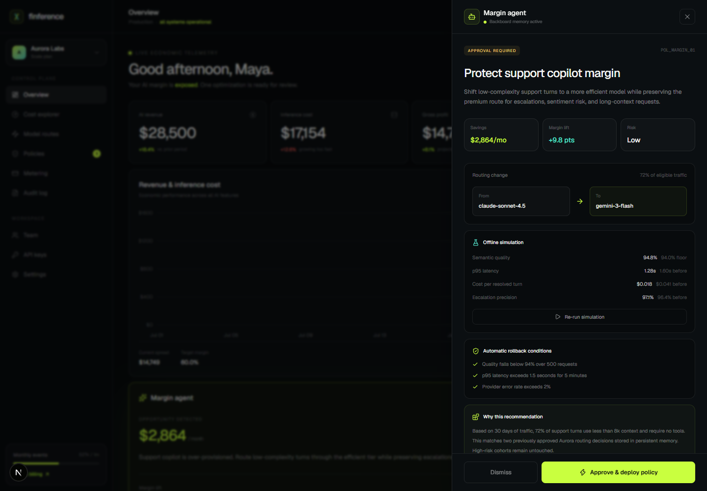
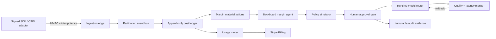

# Finference

**The AI margin control plane.** Finference connects model cost to customer
revenue, finds margin leaks, proposes quality-bounded routing policies, and
turns AI usage into billable units with a complete audit trail.

Built as original work for **Galuxium Nexus V2 (2026)**.

[Live demo](https://finference-ai.vercel.app) ·
[Architecture](docs/ARCHITECTURE.md) ·
[Security model](docs/SECURITY.md) ·
[Devpost submission](docs/DEVPOST.md)



## Why this exists

AI SaaS businesses see ARR immediately but often discover inference COGS weeks
later in a blended provider invoice. That makes it hard to answer:

- Which customer and feature actually created this cost?
- Which routes are below the company’s gross-margin target?
- Can a cheaper model preserve the required quality and latency?
- Who approved a routing change, and what automatically rolls it back?
- How does raw provider usage become a transparent customer invoice?

Finference closes this loop in real time.

## Product workflow

1. **Observe** — Normalize cost, revenue, tokens, latency, model, feature, and
   customer into a signed economic event.
2. **Diagnose** — Calculate contribution margin at model, feature, customer,
   and workspace level.
3. **Recommend** — Use a Backboard-powered agent with persistent memory to
   propose routing changes.
4. **Simulate** — Replay historical traffic and enforce quality, latency, and
   error-rate floors.
5. **Approve** — Require a human decision with bounded blast radius and
   deterministic rollback.
6. **Monetize** — Convert usage into customer-facing units and flush meters to
   Stripe.

## Live demo path

The demo is intentionally preloaded so judges can evaluate the core workflow
without creating an account or supplying API keys.

1. Open `/dashboard`.
2. Review the 52% gross margin and the agent’s $2,864/month opportunity.
3. Inspect the offline simulation, quality floor, persistent-memory evidence,
   and rollback conditions.
4. Click **Approve & deploy policy**.
5. Watch cost fall, margin rise to 61.8%, model economics update, and a new
   immutable audit entry appear.

## Architecture



The repository contains a deployable vertical slice of this architecture:

- Next.js control plane and public product surface
- Strictly validated, HMAC-authenticated ingestion endpoint
- Idempotency/replay protection
- Provider-neutral economic event model
- Deterministic policy simulator and unit-economics engine
- Backboard REST adapter with persistent-memory mode and a no-key demo fallback
- Stripe Checkout adapter with test-mode support and a safe demo fallback
- Responsive, interactive approval and rollback workflow
- Unit tests for financial calculations and policy behavior

See [`docs/ARCHITECTURE.md`](docs/ARCHITECTURE.md) for scaling, storage, and
failure-mode details.

## Economic event schema

```json
{
  "eventId": "evt_48291",
  "occurredAt": "2026-07-30T14:32:08.000Z",
  "workspaceId": "ws_aurora",
  "customerId": "cus_northstar",
  "feature": "support_copilot",
  "provider": "anthropic",
  "model": "claude-sonnet-4.5",
  "inputTokens": 1840,
  "outputTokens": 612,
  "latencyMs": 1284,
  "costUsd": 0.021,
  "revenueUsd": 0.049,
  "status": "ok"
}
```

The schema intentionally uses opaque customer IDs and does **not** require
prompts, completions, emails, or end-user PII.

## Tech stack

| Layer | Choice | Reason |
| --- | --- | --- |
| Web/control plane | Next.js 16, React 19, TypeScript | Server routes, static product pages, fast deployment |
| Design | Tailwind CSS 4, Lucide, Recharts | Consistent system and responsive data visualization |
| Validation | Zod | Boundary validation and explicit contracts |
| Agent memory | Backboard API | Persistent preferences and cross-run decision context |
| Billing | Stripe Checkout/Billing adapter | Subscription and usage-based monetization |
| Tests | Vitest + V8 coverage | Fast deterministic unit testing |
| Deployment | Vercel | Edge delivery, server functions, preview deployments |

## Local setup

Requirements: Node.js 20.19+, 22.13+, or 24+ and npm.

```bash
git clone https://github.com/SameRainbows/finference.git
cd finference
npm install
cp .env.example .env.local
npm run dev
```

Open `http://localhost:3000`.

All primary demo behavior works without external credentials. Add Backboard and
Stripe test-mode keys in `.env.local` to activate the live adapters.

## Environment variables

| Variable | Required | Purpose |
| --- | --- | --- |
| `NEXT_PUBLIC_APP_URL` | Production | Canonical deployment URL |
| `FINFERENCE_INGEST_SECRET` | Production | HMAC-SHA256 event authentication |
| `BACKBOARD_API_KEY` | Optional | Live persistent-memory margin agent |
| `BACKBOARD_ASSISTANT_ID` | Optional | Reuse a configured FinOps assistant |
| `BACKBOARD_LLM_PROVIDER` | Optional | Backboard model provider |
| `BACKBOARD_MODEL_NAME` | Optional | Backboard model name |
| `STRIPE_SECRET_KEY` | Optional | Stripe test/live API key |
| `STRIPE_GROWTH_PRICE_ID` | Optional | Growth subscription price |
| `STRIPE_SCALE_PRICE_ID` | Optional | Scale subscription price |

## Verification

```bash
npm run lint
npm test
npm run build

# or all three
npm run check
```

## API examples

### Health

```bash
curl http://localhost:3000/api/health
```

### Signed ingestion

```bash
BODY='{"eventId":"evt_demo_001","occurredAt":"2026-07-30T14:32:08.000Z","workspaceId":"ws_demo","customerId":"cus_demo","feature":"support_copilot","provider":"anthropic","model":"claude-sonnet-4.5","inputTokens":1000,"outputTokens":400,"latencyMs":940,"costUsd":0.021,"revenueUsd":0.049,"status":"ok"}'
SIGNATURE="sha256=$(printf '%s' "$BODY" | openssl dgst -sha256 -hmac "$FINFERENCE_INGEST_SECRET" -hex | sed 's/^.* //')"
curl -X POST http://localhost:3000/api/ingest \
  -H "Content-Type: application/json" \
  -H "Idempotency-Key: evt_demo_001" \
  -H "X-Finference-Signature: $SIGNATURE" \
  -d "$BODY"
```

## Monetization

- **Growth — $49/month:** 1M events, margin explorer, Stripe meter exports.
- **Scale — $249/month:** 10M events, memory-backed agent, simulation,
  approvals, rollback, long-term evidence.
- **Enterprise:** annual platform fee plus usage, SSO/SCIM, dedicated region,
  custom retention, and data-warehouse export.

The product’s own billing adapter demonstrates the same monetization mechanics
it helps customers implement.

## Security and governance

- HMAC-SHA256 ingestion and timing-safe verification
- Idempotency keys and replay-safe handling
- Strict schema and bounded values at the public boundary
- Opaque customer identifiers; no prompt/completion requirement
- Tenant-scoped architecture and least-privilege approval model
- Human-in-the-loop policy deployment
- Quality, latency, and error-rate rollback conditions
- Server-only provider and billing secrets
- Append-only evidence model for changes and approvals

See [`docs/SECURITY.md`](docs/SECURITY.md).

## License

MIT. See [`LICENSE`](LICENSE).
