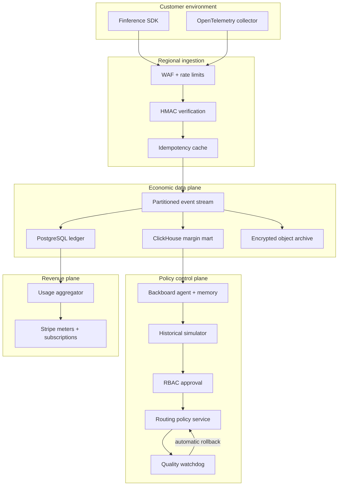

# Finference architecture

## System goals

Finference is designed for high-cardinality AI usage telemetry where financial
correctness, tenant isolation, and safe automation matter more than raw prompt
observability.

Primary invariants:

1. One provider request creates at most one billable economic event.
2. Raw events are append-only; corrections are compensating entries.
3. Every materialized metric can be traced to source event IDs.
4. No routing policy reaches production without evidence and an approver.
5. Every automated policy has a bounded scope and rollback predicate.

## Production topology

## Data partitioning and indexing

- Event stream partition: `workspace_id`, preserving tenant-local ordering.
- Ledger primary key: `(workspace_id, event_id)`.
- Idempotency unique index: `(workspace_id, idempotency_key)`.
- Time-series covering index:
  `(workspace_id, occurred_at desc) include (feature, customer_id, model, cost_usd, revenue_usd)`.
- Materializations: hourly and daily rollups by workspace, customer, feature,
  provider, model, and route policy.
- Large deployments move analytical scans to ClickHouse while PostgreSQL
  remains the authoritative financial ledger.

## Backboard integration

The live adapter calls `POST https://app.backboard.io/api/threads/messages`
with memory enabled. Persistent memory captures:

- accepted quality floors by feature,
- customer SLA exceptions,
- operator risk preferences,
- prior rejected policies and reasons,
- rollback outcomes.

Backboard is not placed in the request-serving hot path. If it is unavailable,
event ingestion and production routing continue; only new recommendation
generation pauses.

## Billing

Meter aggregation runs from the authoritative ledger rather than browser state
or provider webhooks. Each meter flush records:

- source event watermark,
- aggregate unit count,
- Stripe meter event ID,
- retry count and terminal state.

Retries are idempotent. Reconciliation compares internal billable units with
Stripe meter summaries before invoice finalization.

## Failure modes

| Failure | Behavior |
| --- | --- |
| Provider API unavailable | Existing route fallback chain activates |
| Backboard unavailable | Recommendations pause; ingestion continues |
| Stripe unavailable | Meter batches remain durable and retry with backoff |
| Duplicate SDK delivery | Unique idempotency key returns accepted duplicate |
| Quality regression | Watchdog rolls back the policy version |
| Analytics lag | Control plane shows stale watermark and blocks approval |
| Database region loss | Stream replay rebuilds projections in standby region |

## Deployment evolution

The hackathon deployment is a complete vertical slice with in-process demo
state. The interfaces are intentionally separated so PostgreSQL, Redis,
ClickHouse, and Kafka adapters can replace the demo implementations without
changing product components or economic calculations.

