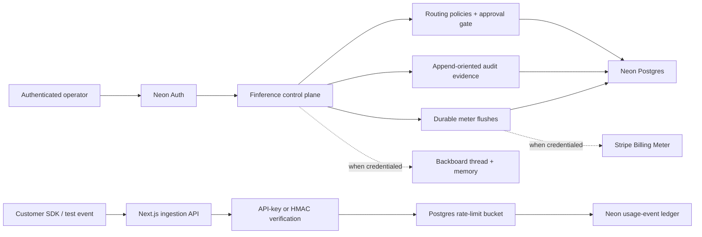

# Finference architecture

## System goals

Finference is a tenant-isolated control plane for AI unit economics. Financial
correctness and governed automation take priority over prompt observability.

Primary invariants:

1. One provider request creates at most one billable economic event.
2. API secrets are never stored in plaintext.
3. Every policy activation is tenant-scoped, role-gated, and audited.
4. Meter batches are derived from the authoritative event ledger.
5. External provider outages do not erase internal financial state.

## Live hackathon deployment

The public `/dashboard` route is a credential-free tour. The protected `/app`
route uses real Neon Auth sessions and real Postgres state. Policy approval,
API-key creation, event ingestion, audit entries, and meter aggregation survive
reloads and deployments.

## Tenant and data model

Every business record carries a `workspace_id` foreign key. Membership is a
composite `(workspace_id, user_id)` key with owner, admin, analyst, and viewer
roles.

Core tables:

| Table | Purpose |
| --- | --- |
| `workspaces` | Tenant, plan, provider bindings, target margin |
| `workspace_members` | Tenant membership and role |
| `workspace_api_keys` | SHA-256 key digest, visible prefix, revocation state |
| `usage_events` | Authoritative cost/revenue/token/latency ledger |
| `routing_policies` | Evidence, rollback predicates, approver, lifecycle |
| `audit_log` | Actor, action, target, status, and evidence |
| `meter_flushes` | Watermarked usage aggregation and Stripe state |
| `webhook_events` | Durable, replay-safe provider webhook ledger |
| `rate_limit_buckets` | Per-credential fixed-window request counts |

## Indexing and concurrency

- Unique event identity: `(workspace_id, external_event_id)`.
- Unique idempotency identity: `(workspace_id, idempotency_key)`.
- Tenant/time access: `(workspace_id, occurred_at)`.
- Tenant dimensions: `(workspace_id, feature)` and
  `(workspace_id, customer_id)`.
- Policy lookup: `(workspace_id, status)`.
- Meter idempotency: `(workspace_id, source_watermark)`.
- API-key lookup: globally unique SHA-256 digest.
- Webhook identity: provider event ID primary key.

Concurrent event deliveries use database uniqueness as the final authority.
Policy activation updates only a still-`proposed` record. Webhooks are claimed
atomically before processing, and failed claims are released for provider
retry. Meter flushes use the last included event as a deterministic watermark.

## Ingestion boundary

The ingestion API accepts either:

1. a generated workspace API key, stored only as a SHA-256 digest; or
2. an HMAC-SHA256 signature over the exact body plus a workspace slug.

The API applies bounded Zod validation, tenant resolution, a durable rate-limit
bucket, and idempotent insertion. Prompt and completion bodies are not part of
the contract.

## Policy governance

The persisted policy state machine allows controlled transitions such as
`proposed -> active -> rolled_back`. Repeat activation and resurrection of
terminal policies are rejected. Only workspace owners and admins can activate
policies or submit billing meters.

Each policy stores:

- feature, source model, destination model, and traffic share;
- quality floor and expected margin lift;
- simulation sample, quality, latency, and escalation evidence;
- deterministic rollback conditions;
- approver and activation timestamps.

## Billing

Finference creates Stripe products, monthly prices, a Billing Meter, Checkout
sessions, and signed webhook handling when Stripe credentials are configured.
Internal meter aggregation works independently:

1. read new billable ledger events after the previous period watermark;
2. aggregate tokens into economic units;
3. persist a unique meter flush;
4. submit the same flush ID as the Stripe meter-event identifier;
5. retain pending/failed state for retry and reconciliation.

The hosted deployment currently reports Stripe as `adapter-ready` because no
external Stripe credential is installed. It does not claim a simulated charge.

## Backboard integration

The adapter creates or reuses a workspace-bound Backboard assistant and thread,
then sends margin context with memory enabled. Backboard is outside the
request-serving ingestion path, so its absence pauses live agent calls but does
not affect ledger writes, policy approval, or billing aggregation.

The hosted deployment currently reports Backboard as `adapter-ready` because no
Backboard account key is installed.

## Scale-out path

The current Neon architecture is sufficient for the demonstrated workload and
keeps financial state strongly consistent. At higher volume:

- place a partitioned event stream between ingestion and storage;
- archive raw events to object storage;
- materialize high-cardinality analytics in ClickHouse;
- retain Postgres as the control-plane and billing authority;
- use regional ingestion with workspace-affine ordering;
- add quality evaluators and a runtime policy distribution service.

These are explicit growth steps, not claims about the current deployment.
